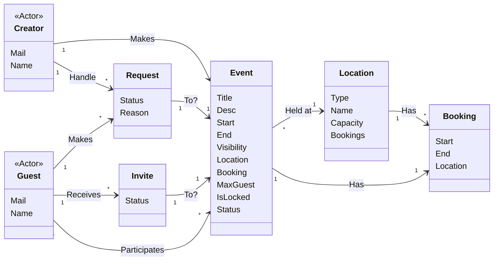

```mermaid
classDiagram
    direction LR
    
    Location "1" --> "*" Booking : Has
    Guest "1" --> "*" Request : Makes
    Event "*" --> "1" Location : Held at
    Event "1" --> "1" Booking : Has
    Creator "1" --> "*" Event : Makes
    Event "*" <-- "1" Guest : Participates
    Guest "1" --> "*" Invite : Receives
    Invite "1" --> "1" Event : To?
    Request "1" --> "1" Event : To?
    Creator "1" --> "*" Request : Handle
    
    class Event {
        Title
        Desc
        Start
        End
        Visibility
        Location
        Booking
        MaxGuest
        IsLocked
        Status
    }

    class Booking {
        Start
        End
        Location
    }

    class Location {
        Type
        Name
        Capacity
        Bookings
    }

    class Creator {
        <<Actor>>
        Mail
        Name
    }

    class Guest {
        <<Actor>>
        Mail
        Name
    }

    class Request {
        Status
        Reason
    }

    class Invite {
        Status
    }
```