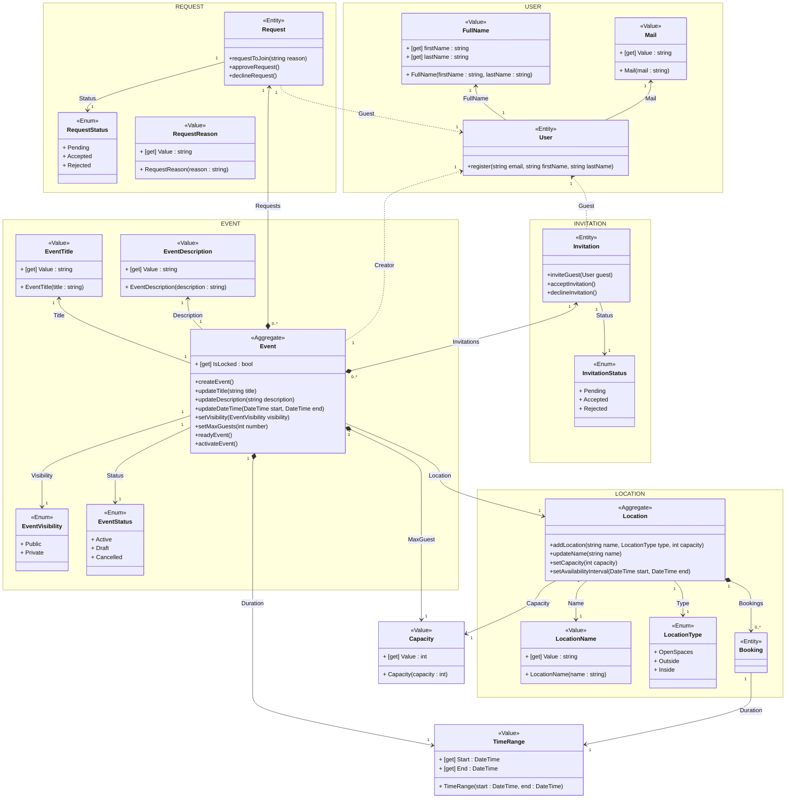

```mermaid
classDiagram
    %%Event
    EventTitle "1" <-- "1" Event : Title
    EventDescription "1" <-- "1" Event : Description
    Event "1" --> "1" EventVisibility : Visibility
    Event "1" --> "1" EventStatus : Status
    Event "1" *--> "1" TimeRange : Duration
    Event "1" *--> "1" Capacity : MaxGuest
    Event "1" --> "1" Location : Location
    Request "1" <--* "0..*" Event : Requests
    Invitation "1" <--* "0..*" Event : Invitations 
    User "1" <.. "1" Event : Creator

    Event : +createEvent()
    Event : +updateTitle(string title)
    Event : +updateDescription(string description)
    Event : +updateDateTime(DateTime start, DateTime end)
    Event : +setVisibility(EventVisibility visibility)
    Event : +setMaxGuests(int number)
    Event : +readyEvent()
    Event : +activateEvent()

    %%Invitation
    Invitation "1" --> "1" InvitationStatus : Status
    User "1" <.. "1" Invitation : Guest

    Invitation : +inviteGuest(User guest)
    Invitation : +acceptInvitation()
    Invitation : +declineInvitation()

    %%Location
    Location "1" --> "1" LocationName : Name
    Location "1" --> "1" LocationType : Type
    Location "1" --> "1" Capacity : Capacity
    Location "1" *--> "0..*" Booking : Bookings

    Location : +addLocation(string name, LocationType type, int capacity)
    Location : +updateName(string name)
    Location : +setCapacity(int capacity)
    Location : +setAvailabilityInterval(DateTime start, DateTime end)

    %%Booking
    Booking "1" --> "1" TimeRange : Duration

    %%User
    FullName "1" <-- "1" User : FullName
    Mail "1" <-- "1" User : Mail

    User : +register(string email, string firstName, string lastName)

    %%Request
    Request "1" --> "1" RequestStatus : Status
    Request "1" ..> "1" User : Guest

    Request : +requestToJoin(string reason)
    Request : +approveRequest()
    Request : +declineRequest()

    class TimeRange {
        <<Value>>
        + [get] Start : DateTime
        + [get] End : DateTime
        + TimeRange(start : DateTime, end : DateTime)
    }

    class Capacity {
        <<Value>>
        + [get] Value : int
        + Capacity(capacity : int)
    }

    namespace EVENT {
        class Event {
            <<Aggregate>>
            + [get] IsLocked : bool
        }

        class EventTitle {
            <<Value>>
            + [get] Value : string
            + EventTitle(title : string)
        }
        
        class EventDescription {
            <<Value>>
            + [get] Value : string
            + EventDescription(description : string)
        }
        
        class EventVisibility {
            <<Enum>>
            + Public
            + Private
        }

        class EventStatus {
            <<Enum>>
            + Active
            + Draft
            + Cancelled
        }
    }
    
    namespace LOCATION {
        class Location {
            <<Aggregate>>
        }

        class LocationType {
            <<Enum>>
            + OpenSpaces
            + Outside
            + Inside
        }

        class LocationName {
            <<Value>>
            + [get] Value : string
            + LocationName(name : string)
        }

        class Booking {
            <<Entity>>
        }
    }

    namespace USER {
        class User {
            <<Entity>>
        }

        class Mail {
            <<Value>>
            + [get] Value : string
            + Mail(mail : string)
        }
        
        class FullName {
            <<Value>>
            + [get] firstName : string
            + [get] lastName : string
            + FullName(firstName : string, lastName : string)
        }

    }
    
    namespace REQUEST {
        class Request {
            <<Entity>>
        }

        class RequestStatus {
            <<Enum>>
            + Pending
            + Accepted
            + Rejected
        }

        class RequestReason {
            <<Value>>
            + [get] Value : string
            + RequestReason(reason : string)
        }
    }
    
    namespace INVITATION {
        class Invitation {
            <<Entity>>
        }

        class InvitationStatus {
            <<Enum>>
            + Pending
            + Accepted
            + Rejected
        }   
    }


```