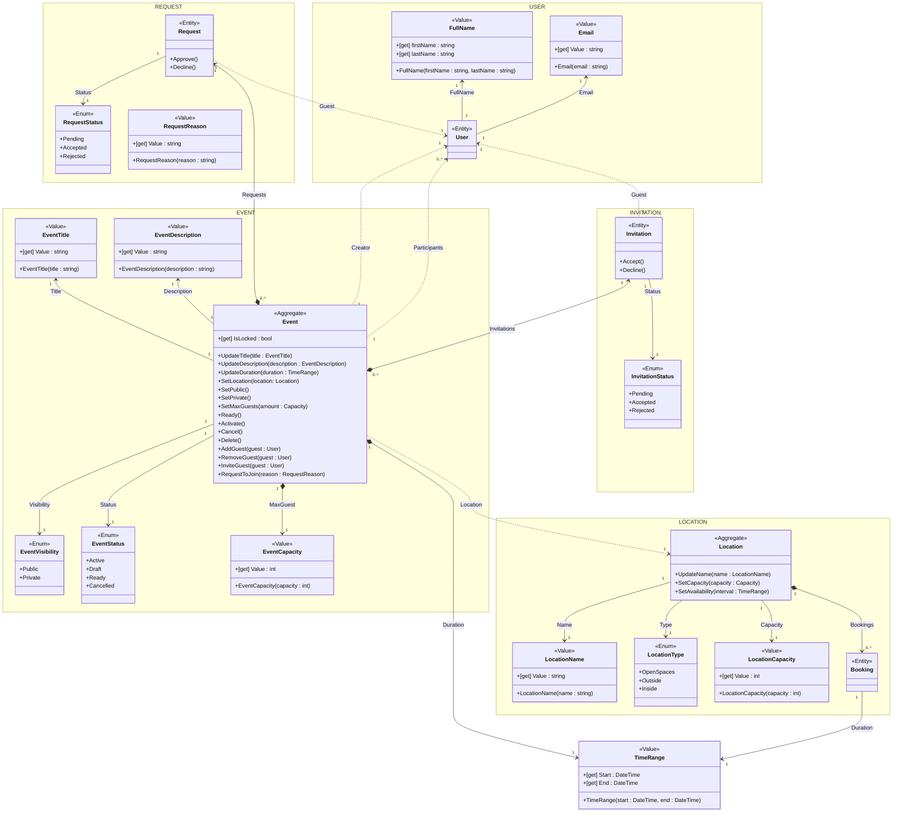

```mermaid
classDiagram
    %%Event
    EventTitle "1" <-- "1" Event : Title
    EventDescription "1" <-- "1" Event : Description
    Event "1" --> "1" EventVisibility : Visibility
    Event "1" --> "1" EventStatus : Status
    Event "1" *--> "1" TimeRange : Duration
    Event "1" *--> "1" EventCapacity : MaxGuest
    Event "1" ..> "1" Location : Location
    Request "1" <--* "0..*" Event : Requests
    Invitation "1" <--* "0..*" Event : Invitations 
    User "1" <.. "1" Event : Creator
    User "0..*" <.. "1" Event : Participants

    %%Invitation
    Invitation "1" --> "1" InvitationStatus : Status
    User "1" <.. "1" Invitation : Guest

    %%Location
    Location "1" --> "1" LocationName : Name
    Location "1" --> "1" LocationType : Type
    Location "1" --> "1" LocationCapacity : Capacity
    Location "1" *--> "0..*" Booking : Bookings

    %%Booking
    Booking "1" --> "1" TimeRange : Duration

    %%User
    FullName "1" <-- "1" User : FullName
    Email "1" <-- "1" User : Email

    %%Request
    Request "1" --> "1" RequestStatus : Status
    Request "1" ..> "1" User : Guest
    
    %% Styling
%%    style Event fill:#cdffb4
%%    style Location fill:#cdffb4
%%    style Request fill:#dae8fc
%%    style User fill:#dae8fc
%%    style Invitation fill:#dae8fc
%%    style Booking fill:#dae8fc
%%    style RequestReason fill:#ffffcc
%%    style FullName fill:#ffffcc
%%    style Email fill:#ffffcc
%%    style EventTitle fill:#ffffcc
%%    style EventDescription fill:#ffffcc
%%    style Capacity fill:#ffffcc
%%    style TimeRange fill:#ffffcc
%%    style LocationName fill:#ffffcc
%%    style RequestStatus fill:#e0d0ff
%%    style InvitationStatus fill:#e0d0ff
%%    style EventStatus fill:#e0d0ff
%%    style EventVisibility fill:#e0d0ff
%%    style LocationType fill:#e0d0ff

    
    

    class TimeRange {
        <<Value>>
        +[get] Start : DateTime
        +[get] End : DateTime
        +TimeRange(start : DateTime, end : DateTime)
    }

    namespace EVENT {
        class Event {
            <<Aggregate>>
            +[get] IsLocked : bool
            +UpdateTitle(title : EventTitle)
            +UpdateDescription(description : EventDescription)
            +UpdateDuration(duration : TimeRange)
            +SetLocation(location: Location)
            +SetPublic()
            +SetPrivate()
            +SetMaxGuests(amount : Capacity)
            +Ready()
            +Activate()
            +Cancel()
            +Delete()
            +AddGuest(guest : User)
            +RemoveGuest(guest : User)
            +InviteGuest(guest : User)
            +RequestToJoin(reason : RequestReason)
        }

        class EventTitle {
            <<Value>>
            +[get] Value : string
            +EventTitle(title : string)
        }
        
        class EventDescription {
            <<Value>>
            +[get] Value : string
            +EventDescription(description : string)
        }
        
        class EventVisibility {
            <<Enum>>
            +Public
            +Private
        }

        class EventStatus {
            <<Enum>>
            +Active
            +Draft
            +Ready
            +Cancelled
        }

        class EventCapacity {
            <<Value>>
            +[get] Value : int
            +EventCapacity(capacity : int)
        }
    }
    
    namespace LOCATION {
        class Location {
            <<Aggregate>>
            +UpdateName(name : LocationName)
            +SetCapacity(capacity : Capacity)
            +SetAvailability(interval : TimeRange)
        }

        class LocationType {
            <<Enum>>
            +OpenSpaces
            +Outside
            +Inside
        }

        class LocationName {
            <<Value>>
            +[get] Value : string
            +LocationName(name : string)
        }

        class LocationCapacity {
            <<Value>>
            +[get] Value : int
            +LocationCapacity(capacity : int)
        }

        class Booking {
            <<Entity>>
        }
    }

    namespace USER {
        class User {
            <<Entity>>
        }

        class Email {
            <<Value>>
            +[get] Value : string
            +Email(email : string)
        }
        
        class FullName {
            <<Value>>
            +[get] firstName : string
            +[get] lastName : string
            +FullName(firstName : string, lastName : string)
        }

    }
    
    namespace REQUEST {
        class Request {
            <<Entity>>
            +Approve()
            +Decline()
        }

        class RequestStatus {
            <<Enum>>
            +Pending
            +Accepted
            +Rejected
        }

        class RequestReason {
            <<Value>>
            +[get] Value : string
            +RequestReason(reason : string)
        }
    }
    
    namespace INVITATION {
        class Invitation {
            <<Entity>>
            +Accept()
            +Decline()
        }

        class InvitationStatus {
            <<Enum>>
            +Pending
            +Accepted
            +Rejected
        }   
    }
```