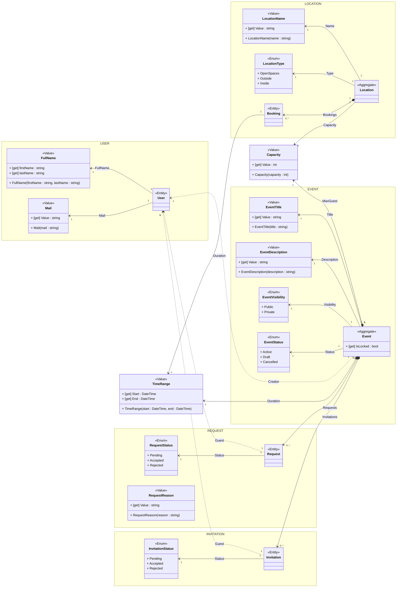

```mermaid
classDiagram
    direction RL

    %%Event
    Event "1" --> "1" EventTitle : Title
    Event "1" --> "1" EventDescription : Description
    Event "1" --> "1" EventVisibility : Visibility
    Event "1" --> "1" EventStatus : Status
    Event "1" *--> "1" TimeRange : Duration
    Event "1" *--> "1" Capacity : MaxGuest
    Event "1" *--> "0..*" Request : Requests
    Event "1" *--> "0..*" Invitation : Invitations 
    Event "1" ..> "1" User : Creator
    
    %%Location
    Location "1" --> "1" LocationName : Name
    Location "1" --> "1" LocationType : Type
    Location "1" --> "1" Capacity : Capacity
    Location "1" *--> "0..*" Booking : Bookings
    
    %%Booking
    Booking "1" --> "1" TimeRange : Duration

    %%User
    User "1" --> "1" FullName : FullName
    User "1" --> "1" Mail : Mail
    
    %%Request
    Request "1" --> "1" RequestStatus : Status
    Request "1" ..> "1" User : Guest
    
    %%Invitation
    Invitation "1" --> "1" InvitationStatus : Status
    Invitation "1" ..> "1" User : Guest

    class TimeRange {
        <<Value>>
        + [get] Start : DateTime
        + [get] End : DateTime
        + TimeRange(start : DateTime, end : DateTime)
    }

    class Capacity {
        <<Value>>
        + [get] Value : int
        + Capacity(capacity : int)
    }

    namespace EVENT {
        class Event {
            <<Aggregate>>
            + [get] IsLocked : bool
        }

        class EventTitle {
            <<Value>>
            + [get] Value : string
            + EventTitle(title : string)
        }
        class EventDescription {
            <<Value>>
            + [get] Value : string
            + EventDescription(description : string)
        }
        class EventVisibility {
            <<Enum>>
            + Public
            + Private
        }

        class EventStatus {
            <<Enum>>
            + Active
            + Draft
            + Cancelled
        }
    }
    
    namespace LOCATION {
        class Location {
            <<Aggregate>>
        }

        class LocationType {
            <<Enum>>
            + OpenSpaces
            + Outside
            + Inside
        }

        class LocationName {
            <<Value>>
            + [get] Value : string
            + LocationName(name : string)
        }

        class Booking {
            <<Entity>>
        }
    }

    
    namespace USER {
        class User {
            <<Entity>>
        }

        class Mail {
            <<Value>>
            + [get] Value : string
            + Mail(mail : string)
        }

        class FullName {
            <<Value>>
            + [get] firstName : string
            + [get] lastName : string
            + FullName(firstName : string, lastName : string)
        }

    }
    
    namespace REQUEST {
        class Request {
            <<Entity>>
        }

        class RequestStatus {
            <<Enum>>
            + Pending
            + Accepted
            + Rejected
        }

        class RequestReason {
            <<Value>>
            + [get] Value : string
            + RequestReason(reason : string)
        }
    }
    
    namespace INVITATION {
        class Invitation {
            <<Entity>>
        }

        class InvitationStatus {
            <<Enum>>
            + Pending
            + Accepted
            + Rejected
        }   
    }


```